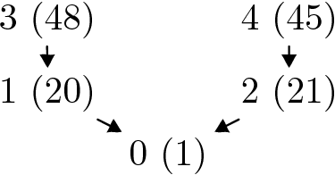
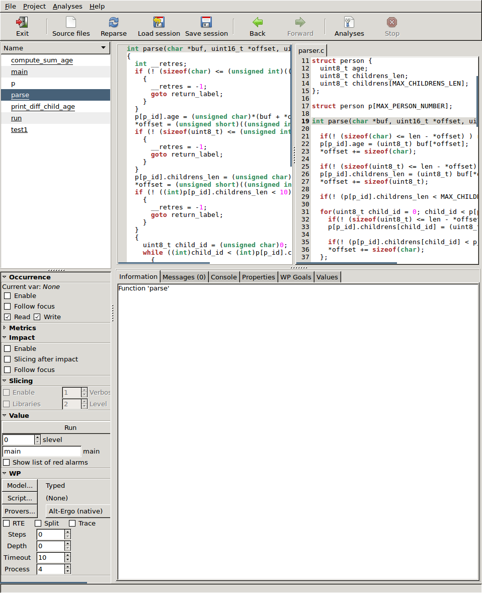

# SSAS 2018 Frama-C Tutorial: Parser #

Requirements:

 * Frama-C version 20180501 (Chlorine)
 * Why3 version 0.88.3
 * Alt-Ergo
 * Z3 (do not install via opam; use a distribution package if possible)
 * Why3 and Frama-C GUI configured to use both Alt-Ergo and Z3
   (`why3 config --detect`, then check in the Frama-C GUI that both provers are
   enabled)

The goal of this tutorial is to discover the Frama-C plugins Eva (new
version of Value), E-ACSL and WP. It will be done via the verification of a
small parser and some computations on the parsed data.

The input data to be parsed is a list of persons with their age and children.
The data is presented in a simple binary format: integer values
are directly the character number, not a decimal ascii notation.
The format of a sequence of persons is:

- the age of the person;
- the number of children;
- the order of each child in the sequence (first is 0)

The data is parsed until it no longer follows the format.

For instance, the following sequence:

    1, 0, 20, 1, 0, 0, 255

Represents the following data:

- a person of age 1, having 0 children;
- followed by a person of age 20, having 1 child, which is the first element in
  list (0-indexed);
- followed by a person of age 0 having 255 (!) children, but the list of children
  is not present; since this does not follow the format, parsing halts at this step.

Note that the size of the string that describes each person depends on the number
of children they have.

After the parsing, the program prints the list of persons (one per
line) with the age difference between each person and their children.
Finally, it prints the sum of the ages of all persons.

This tutorial will, in a step-by-step process, try to verify the absence
of undefined behaviors, plus some functional behaviors of the program.
First, we are going to execute the code, then analyze it with Eva,
instrument it with E-ACSL, and finally finalize the proof with WP.

## Compilation and execution of the program ##

First, you should copy `parser0.c` into `parser.c`. Then you can run
`make run_test`. The output should be:

```
cc    -c -o lib_extra_eacsl/lib_extra_eacsl.o lib_extra_eacsl/lib_extra_eacsl.c
gcc -I lib_extra_eacsl lib_extra_eacsl/lib_extra_eacsl.o parser.c -o parser
printf "\001\000\024\001\000\025\001\000\060\001\001\055\001\002\000\377" | ./parser
i=16
0(1) :
1(20) : 19
2(21) : 20
3(48) : 28
4(45) : 24
sum: 135
```

The data used as example represents five persons (the last `\000\377` is
there to end the parsing); a one year old child, his two parents, of
ages 20 and 21, and two of his grand-parents, of ages 48 and 45.




You should inspect the file `parser.c` in order to have a first idea of
the different functions used. `emacs` is available in the virtual machine.

## Frama-C Parsing and Normalization ##

The first step of the verification of a use case is the parsing by
Frama-C. Mainly it consists in identifying the set of `.c` files that
generate the `.o` to be linked in the final binary or library, and how they
are compiled. The way they are compiled (e.g the `-D` and `-I` flags used)
could be given through the use of option `-json-compilation-database`, which
uses a database generated by `cmake`, `omake` or `bear make`.
In this tutorial, there is a unique file `parser.c`, without additional `-I`.
So we can run the following:

```
frama-c-gui -machdep x86_64 parser.c
```

The option `-machdep x86_64` indicates the architecture of the
compilation used; use `x86_32` if your computer is 32-bit. The
Frama-C GUI screenshot in the figure below shows several panels,
the top three being: on the left side, the list of globals; in the middle, the
source code normalized by Frama-C; on the right side, the original code. A right
click on the `Name` button in the left panel allows to hide/show different
kinds of globals. We recommend checking *hide stdlib*. If you select
function `parse`, you can see that the normalization results in
a single `return` statement for each function (with `goto`s leading to it).



## First pass with Eva ##

### Unreachable Code ###

The first verification will be done by Eva, which will add alarms in
the code. The alarms are undefined behaviors that Eva cannot rule out.
Select the `main` function. The main function initializes the memory
using the built-in function
`Frama_C_make_unknown((char*)buf,(unsigned long)100);`.
By right-clicking the function name and using `Go to
definition`, you are taken to its definition or, in case the function is just
declared, as in this case, to its declaration, plus its ACSL function contract.
The contract means that the function
requires the given buffer to be valid between `0` and `(l-1)`,
ensures that after the execution of the function the buffer is initialized
between `0` and `(l-1)`, and finally ensures that only the
buffer and `Frama_C_entropy_source` (a global variable) have been modified.
When we previously executed the program, the function was defined as copying
from the standard input the value used to fill the buffer. Coming back to
the `main` function, the analysis will suppose nothing about the contents
of the buffer `buf`.

In the left-bottom panel, controls for the different plugins are
available. Look for the Value panel, check that `main` is used for
the `main` function. Click on the run button. On the command line, the
same action would be done with:

```
frama-c-gui -machdep x86_64 parser.c -val
```

The semi-colon after `run(buf,len);` is now red, which indicates that
whatever the value of the buffer at the start, the end of the statement (and here, of the
program) is unreachable. It can mean that the analysis is not well
configured (wrong `machdep`, missing `-D`, etc), or that there is
an undefined behavior that *always* happens. We can dive into the code
by going into the last function call that is reachable, repeatedly.
We arrive at the first line of function `parse`, where Eva (Value) inserted an
alarm:

```
 /*@ assert Value: initialization: \initialized(offset); */
```

Which has a red-yellow bullet. Hovering the mouse over it, a tooltip explains
that the property is *Invalid under hypotheses*. The *hypotheses* part refers
to *being reachable*, as in,
*if this code is reachable, then this property is invalid*.
The *invalid* means that, for all the possible values of the
buffer, the `offset` variable points to an uninitialized left-value.
If you select the `Values` tab, in the middle below the normalized code,
you will have displayed the values computed by Eva for the expression selected
in the normalized code (highlighted in green). Click on different parts of the
assertion to see the values computed by Eva.

Open your favorite editor and fix the definition of `offset` in `run`
to `uint16_t offset = 0;`. Hint: by default, Emacs is configured to open when
control-clicking a line in the *original* source code.

After patching the code, close and restart `frama-c-gui` with the previous
command, or click on `reparse` and restart the analysis. Now in the `main`
function you can see that there is no red anymore.

### Using option slevel ###

Even if Eva can be thought of as a push-button technique, usually it
needs some configuration for best results. For example, the `slevel`
option roughly describes how many times the analysis can go through a
statement without losing precision. That can be illustrated by
using function `test1` as the main function, and running the
analysis. From the command line:

```
frama-c-gui -machdep x86_64 parser.c -val -main test1
```

Then, inside function `test1`, click on the declaration of `sum` and look at the
*Values* panel. `sum (after)` is only known to be in the interval
`0..255`. Now, in the bottom left panel *Value*, next to *slevel*, put value 10
and click *Run*. Or, equivalently, re-run from the command line:

```
frama-c-gui -machdep x86_64 parser.c -val -main test1 -slevel 10
```

The value for `sum` is now exactly `36`. You can play with the value of `slevel`
and look into the other functions the effect on the approximation computed
by Eva. An `slevel` with a value greater than 100 is usually not
needed; other features of the analyzer should be tried instead.

_Note: if you change the slevel and re-run the analysis, but without clicking
on *Reparse*, the *Messages* panel will **not** reset its warnings._


### Additional domains ###

If we come back to the main function being `main`, with a `slevel` of
10, and run the analysis, we can look at the alarms and properties
that are not proved. Inside tab *Properties* (to the left of *Values*),
unset *Current function* and click on *Refresh*. Click on the
first yellow property from the function `parse`.

```
/*@ assert Value: index_bound: child_id < 10; */
```

In the *Values* panel, we can see that the variable `child_id` is not
known to be different from 10. The while loop enforces that it is
strictly smaller than `(int)p[p_id].children_len`, but this value itself is
only known to be between 0 and 255. This seems strange, because there was
a test a few lines before which ensured that `p[p_id].childrens_len` was
strictly smaller than 10. That test was indeed not able to constrain the value
of `p[p_id].children_len`, because `p_id` is approximated between 0 and 49, so
Eva does not know which memory zone to update. The solution is to use the
*symbolic locations domain*, which keeps an approximation for the whole
`p[p_id].children_len`. To enable it in the GUI, go to menu *Analyses/Analyses*,
then *Value analysis*, and then unfold the *Abstract Domains* part. Finally,
check `-eva-symbolic-locations-domain`. On the command line, this can be done via:

```
frama-c-gui -machdep x86_64 parser.c -val -slevel 10 -eva-symbolic-locations-domain
```

Now the alarm becomes green.
If you run it directly from the command line, Eva does not even generate it.

The two remaining unproven properties are in `print_diff_child_age`
(as shown in the tab *Properties*).
As part of the exercise, we are going to consider that we have done enough with
Eva, and we are now going to ask E-ACSL to add instrumentations which will stop
the program during execution, if one of these alarms fails.

## Dynamic checks generation: E-ACSL ##

We are going to ask E-ACSL to generate an
instrumented version of our program:

```
frama-c -machdep x86_64 parser.c -val -slevel 10 -eva-symbolic-locations-domain \
 -e-acsl-prepare -then -e-acsl -then-last -print -ocode annotated.c
```

This command asks E-ACSL to generate an instrumented version of the program in file `annotated.c` to check the
properties not yet proved by Eva. The option `-then` allows to sequence
the analysis. The option `-e-acsl-prepare` is needed before the first
`-then` for some bookkeeping used by E-ACSL. The generated file can be
compiled using a companion script of E-ACSL:

```
e-acsl-gcc.sh -C -c -e "-Ilib_extra_eacsl/" -l lib_extra_eacsl/lib_extra_eacsl.o annotated.c
```

This script performs linking with the instrumentation library of E-ACSL.

The annotated binary is called `a.out.e-acsl` by default, and can be tested using:

```
printf "\001\000\024\001\000\025\001\000\060\001\001\055\001\002\000\377" | ./a.out.e-acsl
```

### Silent bug ###

Now we are testing our program (annotated or not) with this input:

```
printf "\065\000\067\000\116\002\000\001\120\002\000\001\150\001\003\000\377" | ./a.out.e-acsl
```

The output is:
```
i=17
0(53) :
1(55) :
2(78) : 25 23
3(80) : 27 25
4(104) : 24
sum: 114
```

Which gives a false sum. By adding this `test2` function in parser.c,
and selecting it as the main function:

```
void test2(){

  uint8_t test[] = { 53, 0, 55, 0, 78, 2, 0, 1, 80, 2, 0, 1, 104, 1, 3, 0, 255 };
  uint16_t len = sizeof(test);

  uint64_t sum = run(test,len);
  /*@ assert p[2].children[1] == 1; @*/
  /*@ assert sum == (53 + 55 + 78 + 80 + 104); @*/
}
```

```
frama-c-gui -machdep x86_64 parser.c -val -slevel 10 -eva-symbolic-locations-domain -main test2
```

Eva disagrees with the last assertion. On the right-hand side, the
value is computed mathematically; on the left-hand side, it is the
result of the program computation. The value is computed in
`compute_sum_age`; if one looks in this function at the values of `sum` inside the loop,
one can see that, before the addition, `sum` can have the values 0,
10, 53, 108, or 186; after the statement, it can be 10, 53, 108, 114 or 186.
Before the cast to `unsigned char`, the additions have values between 63 and 290.
We have a *downcast* problem. Indeed, sum is an `uint8_t`.
Eva does not detect this overflow by default, because it is defined
in the C standard. However, one can force Frama-C to consider this case
as undefined with the option: `-warn-unsigned-downcast`. Once this
option is added, through the menu or in the command line, Eva add alarms
such as:

```
/*@ assert
  Value: unsigned_downcast: (int)sum + (int)p[p_id].age ≤ 255;
*/
```

Also, when using `test2` as `main`, some
red (unreachable) code is seen in the GUI.

If we recreate the instrumented binary with:
```
frama-c -machdep x86_64 parser.c -val -slevel 10 -eva-symbolic-locations-domain \
 -warn-unsigned-downcast \
 -e-acsl-prepare -then -e-acsl -then-last -print -ocode annotated.c
e-acsl-gcc.sh -C -c -e "-Ilib_extra_eacsl/" -l lib_extra_eacsl/lib_extra_eacsl.o annotated.c
```

The execution of the instrumented binary fails:
```
 % printf "\065\000\067\000\116\002\000\001\120\002\000\001\150\001\003\000\377" | ./a.out.e-acsl
i=17
0(53) :
1(55) :
2(78) : 25 23
3(80) : 27 25
4(104) : 24
Assertion failed at line 64 in function compute_sum_age.
 The failing predicate is:
Value: unsigned_downcast: (int)sum + (int)p[p_id].age <= 255.
```

The bug is fixed by replacing `uint8_t sum;` with `uint64_t sum;`.

Two properties remain not proved. How can we be sure that, now, for any
input, the computation of the sum is correct? For that, we are going to
use WP.

## Deductive verification ##

We are going to add our own specifications and we are going to use the
WP plugin to prove that they hold. Firstly we are going to prove the
two properties of `print_diff_child_age`.

```
/*@ assert Value: index_bound: p[p_id].children[i] < 50; */
/*@ assert Value: index_bound: i < 10; */
```

For that we need four properties on the array of persons. We are going
to prove that after parsing, each `p_id` person has a
number of children smaller than 10, and each child has a number (id) smaller
than that of its parents. It seems that the property is
stronger than necessary (the actual property is written as "the number (id)
of each person is smaller than 50), but it is the
same difficulty at the end.

As the first step, we are
going to prove that the number of children is smaller than 10. For
that we define a predicate:

```
/*@
predicate valid_person(integer i) =
   p[i].children_len < MAX_CHILDREN_LEN;
@*/
```

We add it as a postcondition of `parse`:

```
/*@
  ensures \result == 0 ==> valid_person(p_id);
  assigns *offset, \result, p[p_id].age, p[p_id].children_len, p[p_id].children[ 0 .. MAX_CHILDREN_LEN ];
  @*/
int parse(uint8_t *buf, uint16_t *offset, uint16_t len, uint8_t p_id){
```

For the proof, we need to know which parts of the memory were modified by
the function. We also need to add a `loop assigns` (you have to complete
the `....`):

```
/*@
  loop assigns ....;
@*/
```

Now we can run WP (inside the gui or from the command line), using the
Alt-Ergo and Z3 provers:

```
frama-c-gui -machdep x86_64 parser.c -val -slevel 10 -eva-symbolic-locations-domain \
 -then -wp -wp-prover alt-ergo,z3 -wp-timeout 1
```

You can also run it without the `-gui` and check the evolution of the
number of goals not proved (before any annotation `Proved goals 0/2`).

In function `print_diff_child_age` we need to add that it requires a
valid person, plus the `loop assigns` (`printf` assigns  `__fc_stdout->__fc_FILE_data`).

Now we need to transport this property to the function
`print_diff_child_age`, so we need to add a loop invariant in the
function `run`.

```
/*@
   loop invariant ... ;
@*/
for(p_nb = 0; p_nb < MAX_PERSON_NUMBER; p_nb++){
```

This loop invariant must state that for all `i` between 0 and `p_nb`, at
`i` we have a `valid_person(i)`. Quantification is written as `\forall
integer i;`, and implication as `==>`.

For the second loop of `run`, we need a `loop assigns` and an assign
for function `print_diff_child_age`.

Now all the additional properties should be proved, with only one property
remaining to be proved. We just need to add that: all the children of
valid persons have a smaller id; that `print_diff_child_age` requires
a `p_id` between 0 and `MAX_PERSON_NUMBER`; and one last invariant to write.
Conjunctions are written as `&&`.

Now everything should be proved. It can be remarked that the
verification done by WP uses the fact that all undefined behaviors
have been proved as impossible.

### Proof of Functional Behavior ###

The unsigned cast overflow showed that we can be mistaken about what is
computed by a program. Using deductive verification, we are going to
prove that `compute_sum_age` does compute the sum.

For that, we first need to define which is the correct behavior, by
declaring and defining, using axioms, a logic function `sum_age`:

```
/*@
  axiomatic Sum {
  logic integer sum_age(integer p_nb) reads p[ 0 .. MAX_PERSON_NUMBER ];
  axiom sum_0: sum_age(0) == 0;
  axiom sum_n: \forall integer i; 0 < i ==> sum_age(i) == p[i-1].age + sum_age(i-1);
}
@*/
```

The `reads` clause indicates on which part of the memory the logic
function depends.

Then, we can add that `compute_sum_age` ensures that `\result` (the
value returned by the function) is equal to `sum_age(p_nb)`, and we
need to add three `loop invariant`, one `loop assigns` and one
`requires` in `compute_sum_age`.

At the end, Frama-C/WP should be able to prove all remaining properties.

## Conclusion ##

This tutorial has illustrated how to use Eva, E-ACSL and WP to prove different
properties of a small code base. It showed how these tools may complement each
other, thanks to the common language between them, ACSL, which enables the
sharing of properties.

Each plug-in has its strengths and special usage considerations, and although
this short tutorial has just skimmed some of them, we hope it has given you an
insight into the Frama-C platform and will help you in your future verification
endeavors!

-- François Bobot, André Maroneze, & the Frama-C team
